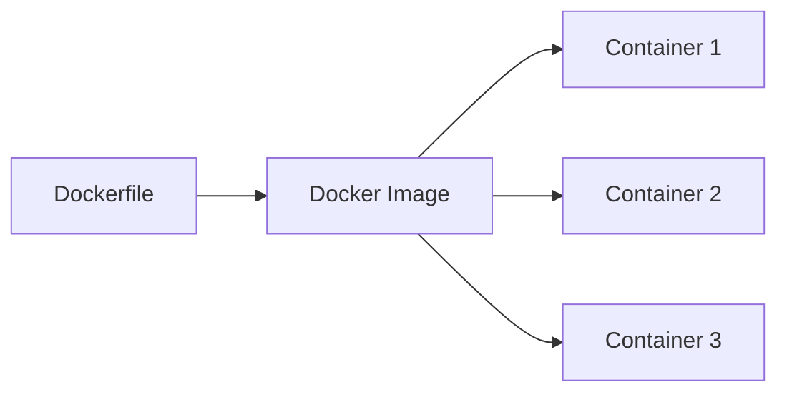

# 🐳 How Docker Helps

> **Understanding how Docker solves development and deployment challenges**

---

## 🔑 Core Concept

Docker provides a **Container**, which is a **single isolated unit** that contains:

| Component | Description |
|-----------|-------------|
| 📱 **The Application** | Your actual code and project |
| 📦 **All Required Dependencies** | Libraries, modules, packages |
| 🔧 **Exact Versions** | Tools and libraries with specific versions |

### 🎯 Key Principle

👉 Everything stays **together**, so the application behaves **the same on every PC**.

```
┌─────────────────────────────────┐
│       Docker Container          │
│  ┌───────────────────────────┐  │
│  │   Your Application        │  │
│  ├───────────────────────────┤  │
│  │   Node.js v18             │  │
│  │   Angular v17             │  │
│  │   Bootstrap v5.x          │  │
│  │   All Dependencies        │  │
│  └───────────────────────────┘  │
└─────────────────────────────────┘
```

---

## 📦 What is a Container?

A **container** is a lightweight, isolated environment where we store:

| What It Stores | Example |
|----------------|---------|
| ✅ **Runtime Version** | Node.js v18, Python 3.11 |
| ✅ **Required Modules** | Express, React, Angular CLI |
| ✅ **Libraries** | npm packages, system libraries |
| ✅ **Configuration** | Environment variables, settings |
| ✅ **Application Code** | Your source code |

---

### ⭐ Important Guarantee

A container guarantees:

> 🧠 **"Works on my machine = Works on every machine"**

No matter where the container runs:

```diff
+ Developer PC      ✅ Works
+ Tester PC         ✅ Works
+ Production Server ✅ Works
+ Client Machine    ✅ Works
```

---

## ✅ Advantages of Containers

### 🔁 1. Portable

| Feature | Benefit |
|---------|---------|
| 🌍 **Cross-Platform** | Runs on Windows, Linux, macOS |
| ☁️ **Cloud Ready** | Works on AWS, Azure, Google Cloud |
| 🖥️ **Hardware Independent** | Same behavior on any machine |
| 🔄 **Easy Migration** | Move between environments seamlessly |

```bash
# Same container runs everywhere
docker run my-app  # Works on Windows
docker run my-app  # Works on Linux
docker run my-app  # Works on macOS
```

---

### 🪶 2. Lightweight

Compared to **Virtual Machines**:

| Aspect | Virtual Machine | Docker Container |
|--------|----------------|------------------|
| **Startup Time** | Minutes ⏰ | Seconds ⚡ |
| **Resource Usage** | Heavy (GBs) 🐘 | Light (MBs) 🪶 |
| **Disk Space** | Large 💾 | Small 💿 |
| **Performance** | Slower 🐢 | Faster 🚀 |

---

### ⚡ 3. Fast & Easy Operations

Easy to:

```bash
# Create a container
docker run -d my-app

# Stop a container
docker stop my-app

# Delete a container
docker rm my-app

# Update a container
docker pull my-app:latest
docker run my-app:latest
```

**Benefits:**
- 🚀 Fast startup time
- 🔄 Quick updates
- 🗑️ Easy cleanup
- 💰 Cost-effective

---

## 🧪 Example: Managing Multiple Dependencies

### 🔍 Scenario

We are developing **two applications at the same time**:

| Application | Required Node Version | Framework |
|------------|----------------------|-----------|
| 🟢 **App 1** | Node.js 18 | Angular v17 |
| 🔵 **App 2** | Node.js 21 | React v18 |

---

### ❌ Problem Without Docker

```diff
- Only one Node version can be active on system
- Installing Node 21 overwrites Node 18
- Version conflict occurs
- One app breaks the other
- Constant switching between versions
- Development becomes painful
```

**Visual Representation:**

```
System
├── Node.js v18 ❌ (gets replaced)
└── Node.js v21 ✅ (currently active)

Result: App 1 breaks! 💥
```

---

### ✅ Solution With Docker

Create **two separate containers**:

```
Container 1                    Container 2
┌──────────────────┐          ┌──────────────────┐
│  App 1           │          │  App 2           │
│  Node.js v18 ✅  │          │  Node.js v21 ✅  │
│  Angular v17     │          │  React v18       │
└──────────────────┘          └──────────────────┘
       ↓                             ↓
   Runs Fine ✅               Runs Fine ✅
```

**Benefits:**
- Each container has its **own Node version**
- Both apps run **simultaneously without conflict**
- 📌 Each application gets **exactly what it needs**
- 🔄 Easy to switch between projects
- 🎯 No version conflicts

```bash
# Run both apps at the same time
docker run -d -p 4200:4200 app1  # Angular app
docker run -d -p 3000:3000 app2  # React app
```

---

## 🏥 Real-Life Analogies (Easy to Understand)

### 🍱 Analogy 1: Tiffin Box

Imagine:

| Concept | Real Life | Docker |
|---------|-----------|--------|
| 👤 **Person** | Each person | Each application |
| 🍱 **Tiffin Box** | Individual container | Docker container |
| 🍛 **Food** | Personal preference | Dependencies |
| 🥄 **Utensils** | Tools needed | Runtime & libraries |

**How It Works:**

Each person carries:
- ✅ Their own food (dependencies)
- ✅ Their own quantity (exact versions)
- ✅ Their own taste preference (configuration)

```
Person A          Person B          Person C
┌────────┐       ┌────────┐       ┌────────┐
│ Rice   │       │ Pasta  │       │ Bread  │
│ Dal    │       │ Sauce  │       │ Butter │
│ Sabzi  │       │ Cheese │       │ Jam    │
└────────┘       └────────┘       └────────┘
```

👉 **No food mixing** = No dependency conflict  
👉 **Independent boxes** = Isolated containers  
👉 **Everyone happy** = All apps work perfectly

---

### 📦 Analogy 2: Shipping Containers

| Shipping World | Docker World |
|----------------|--------------|
| 🚢 **Container** | Docker Container |
| 📦 **Goods Inside** | Application + Dependencies |
| 🌍 **Any Ship/Port** | Any OS/Platform |
| 🔒 **Sealed & Safe** | Isolated & Secure |

**Benefits:**
- Standard size (portable)
- Works with any ship (any OS)
- Contents protected (isolated)
- Easy to track (manageable)

---

## 🌐 Docker Hub & How It Works

### 1️⃣ Creating a Docker Image

A **Docker Image** is created using a `Dockerfile`.

**The image contains:**

```dockerfile
# Example Dockerfile
FROM node:18              # Base OS + Runtime
WORKDIR /app              # Working directory
COPY package*.json ./     # Dependencies list
RUN npm install           # Install dependencies
COPY . .                  # Copy app code
CMD ["npm", "start"]      # Start command
```

**What's Included:**

| Component | Description |
|-----------|-------------|
| 🖥️ **Base OS** | Linux, Alpine, Ubuntu, etc. |
| ⚙️ **Runtime** | Node.js, Java, Python, .NET |
| 📦 **Dependencies** | npm, pip, Maven packages |
| 📝 **Instructions** | How to run the app |

📌 An image is **NOT running** — it is just a **blueprint/template**.

---

### 2️⃣ Image vs Container (Key Relationship)

| Term | What It Is | State | Example |
|------|-----------|-------|---------|
| 🖼️ **Docker Image** | Blueprint/Template | Static | Recipe card |
| 🚀 **Container** | Running Instance | Active | Cooked dish |

**Visual Representation:**

```
Docker Image                      Containers
┌────────────┐                   ┌────────────┐
│            │    docker run →   │ Container 1│
│   Image    │    docker run →   │ Container 2│
│  (Static)  │    docker run →   │ Container 3│
└────────────┘                   └────────────┘
    (1 Image)                    (Multiple Instances)
```

---

### 👨‍🏫 Programming Analogy

Perfect analogy for developers:

```javascript
// Class = Docker Image (Blueprint)
class Application {
  constructor() {
    this.nodejs = "v18";
    this.framework = "Angular";
  }
}

// Object = Container (Instance)
const container1 = new Application(); // Running instance 1
const container2 = new Application(); // Running instance 2
const container3 = new Application(); // Running instance 3
```

| OOP Concept | Docker Equivalent |
|-------------|-------------------|
| 📘 **Class** | Docker Image |
| 📦 **Object** | Container |
| 🏗️ **Constructor** | Dockerfile |
| ⚙️ **new Keyword** | docker run command |

---

### 🔄 Image to Container Flow



**Commands:**

```bash
# 1. Build image from Dockerfile
docker build -t my-app:v1 .

# 2. Create multiple containers from one image
docker run -d --name app-instance-1 my-app:v1
docker run -d --name app-instance-2 my-app:v1
docker run -d --name app-instance-3 my-app:v1
```

---

## 🏗 Real-Life Example (Image vs Container)

### 🏠 House Building Analogy

| Construction | Docker |
|--------------|--------|
| 📐 **Blueprint** | Docker Image |
| 🏠 **Actual House** | Container |
| 👷 **Builder** | Docker Engine |
| 🔨 **Build Process** | docker build |
| 🔑 **Move In** | docker run |

**How It Works:**

```
Blueprint (Image)           Actual Houses (Containers)
┌──────────────┐           ┌──────┐ ┌──────┐ ┌──────┐
│   📐         │           │ 🏠-1 │ │ 🏠-2 │ │ 🏠-3 │
│  Floor Plan  │  ──────→  │      │ │      │ │      │
│  Materials   │           │ Lived│ │ Lived│ │ Lived│
└──────────────┘           └──────┘ └──────┘ └──────┘
   (1 Blueprint)           (Multiple Independent Houses)
```

**Key Points:**
- 📐 From **one blueprint**, you can build **many houses**
- 🏠 Each house is **independent** and **functional**
- 🔧 Modify blueprint → Rebuild houses with changes
- 🐳 Same with Docker: One image → Multiple containers

---

## 📊 Docker Workflow Summary

```
Developer                Docker                 Deployment
┌────────┐              ┌──────┐              ┌──────────┐
│ Write  │──────────→   │Build │──────────→   │  Run     │
│ Code   │  Dockerfile  │Image │  docker run  │Container │
└────────┘              └──────┘              └──────────┘
```

**Step-by-Step:**

| Step | Action | Command | Result |
|------|--------|---------|--------|
| 1️⃣ | Write code | - | Application ready |
| 2️⃣ | Create Dockerfile | `vim Dockerfile` | Build instructions |
| 3️⃣ | Build image | `docker build` | Image created |
| 4️⃣ | Run container | `docker run` | App running |
| 5️⃣ | Share image | `docker push` | Available on Docker Hub |

---

## 📝 Summary

### ✅ Docker Benefits

| Problem | Docker Solution |
|---------|----------------|
| ❌ Dependency conflicts | ✅ Isolated containers |
| ❌ "Works on my machine" | ✅ Consistent everywhere |
| ❌ Complex setup | ✅ One-command deployment |
| ❌ Version mismatch | ✅ Locked versions |
| ❌ Slow deployment | ✅ Fast & reliable |
| ❌ Team collaboration issues | ✅ Shared images |

---

### 🎯 Key Takeaways

> 🐳 **Docker ensures:**
> - ✔️ Consistency across all environments
> - ✔️ Isolation between applications
> - ✔️ Portability across platforms
> - ✔️ Fast and reliable deployments
> - ✔️ Better team collaboration
> - ✔️ Simplified dependency management

---

## 🔜 What's Next?

**Next Topic:** ➡️ [**What is a Dockerfile & How It Works**](./Dockerfile.md)

### You'll Learn:
- 📝 Writing Dockerfile
- 🏗️ Building images
- ⚙️ Dockerfile instructions
- 💡 Best practices
- 🚀 Optimization tips

---

**📚 Related Topics:**
- [Docker Installation](./Docker_Installation.md)
- [Docker Commands](./Docker_Commands.md)
- [Docker Compose](./Docker_Compose.md)

---

<div align="center">

**💡 Remember:** *"Docker containers = Consistency + Portability + Reliability"*  
**🐳 Everything Your App Needs, In One Package!**

</div>