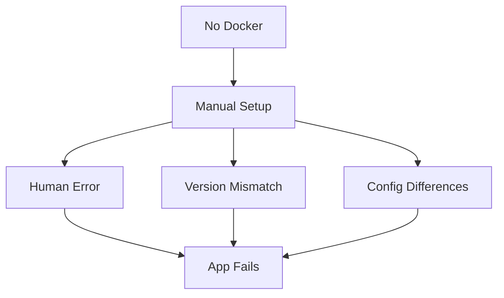

# ❌ The Problem Without Docker

> **Understanding why Docker is essential for modern development**

---

## 🧩 Scenario

Suppose we develop an application named **`xyz`** using the following technology stack:

### 🧪 Technology Stack (Group 3A)

| Technology | Version |
|------------|---------|
| **Node.js** | v18 |
| **Angular** | v17 |
| **Bootstrap** | v5.x |

✅ This application works **perfectly** on the developer's system.

---

## ⚠️ The Conflict

Now, another developer or user wants to run the same application on **their PC**.

### 📋 Requirements
To run the application, they must install:
- ✔️ Node.js
- ✔️ Angular CLI
- ✔️ Bootstrap
- ✔️ Other required dependencies

### ❌ The Critical Mistake

Instead of installing **Node.js version 18**, they accidentally install:

```bash
❌ Node.js version 19  # Wrong version!
```

---

## 💥 The Result

Because some parts of the application are **strictly dependent on Node.js v18**:

| What Happens | Impact |
|--------------|--------|
| ❌ Application **fails to run** | Critical |
| ⚠️ Unexpected errors appear | High |
| 🔴 Compatibility issues | High |
| 😤 User frustration | Maximum |

### 🗣️ The Classic Developer Problem:

> *"It works on my machine, but not on yours!"*  
> — Every Developer Ever

---

## 🚨 Common Issues Without Docker

### 1️⃣ **Dependency Issues**

```diff
- Required dependencies are missing
- Wrong versions are installed
- Manual setup is error-prone
- No version control for environment
```

**Example:**
```bash
# Developer's Machine
Node.js v18 ✅
npm v9.5.0 ✅

# User's Machine
Node.js v19 ❌  # Breaks the app!
npm v10.2.0 ❌
```

---

### 2️⃣ **Environment Differences**

| Issue | Description |
|-------|-------------|
| 🖥️ **OS Differences** | Windows / Linux / macOS behave differently |
| 🔧 **CLI Availability** | Commands work on one system but not another |
| 📁 **Path Issues** | File paths differ across operating systems |
| 🌐 **Port Conflicts** | Different services running on same ports |

**Example:**
```bash
# Linux/macOS
npm install   ✅ Works

# Windows (sometimes)
npm install   ❌ Permission errors
```

---

### 3️⃣ **Deployment Problems**

```diff
! Application works locally but fails on server
! Server configuration differs from local machine
! Production bugs appear unexpectedly
! Scaling becomes nightmare
! Rollback is complicated
```

**Real Scenario:**
```
Local Machine  → ✅ App works perfectly
Test Server    → ⚠️ Some features broken
Production     → 🔴 Complete failure
```

---

## 🏥 Real-Life Analogy (Easy to Understand)

### 🍲 Cooking Analogy

#### 👨‍🍳 Your Kitchen (Developer's Machine)

You cooked a **delicious dish** using:
- 🔥 A **specific gas stove** (Node.js v18)
- ⚙️ A **specific pressure cooker** (Angular v17)
- 🌶️ A **specific brand of spices** (Bootstrap v5.x)

#### 👩‍🍳 Friend's Kitchen (User's Machine)

Your friend tries to cook the **same recipe** but:
- 🔥 Uses a **different stove** (Node.js v19)
- ⚙️ Uses a **different cooker** (Angular v18)
- 🌶️ Misses some spices (Missing dependencies)

### ❌ Result:

```
Expected: 😋 Delicious dish
Reality:  🤢 Disaster!
```

---

### 🎯 The Comparison

| Component | Your Kitchen | Friend's Kitchen | Result |
|-----------|--------------|------------------|--------|
| **Stove** | Gas v18 ✅ | Gas v19 ❌ | Different heat |
| **Cooker** | Brand A ✅ | Brand B ❌ | Different pressure |
| **Spices** | Complete ✅ | Missing ❌ | Wrong taste |
| **Dish** | Perfect ✅ | Failed ❌ | Not same! |

👉 **This is exactly what happens without Docker:**

| Tech Term | Cooking Analogy |
|-----------|-----------------|
| Your app | The dish |
| Dependencies | Ingredients |
| Environment | Kitchen & Equipment |
| Configuration | Recipe instructions |

---

## 🧠 Why This Problem Happens

### Root Causes:



#### Key Reasons:

| # | Reason | Impact |
|---|--------|--------|
| 1️⃣ | Each system is configured differently | 🔴 High |
| 2️⃣ | Dependency versions are not controlled | 🔴 High |
| 3️⃣ | Setup is manual and inconsistent | 🟠 Medium |
| 4️⃣ | No standardization across environments | 🔴 High |
| 5️⃣ | Documentation becomes outdated | 🟠 Medium |

---

## 📝 Summary Table

### ❌ Problems Without Docker

| Problem Area | Issues | Frequency |
|--------------|--------|-----------|
| **Environment** | Mismatch occurs | Always 🔴 |
| **Dependencies** | Conflict happens | Very Often 🟠 |
| **Deployment** | Becomes painful | Often 🟠 |
| **Collaboration** | Becomes difficult | Always 🔴 |
| **Onboarding** | Takes hours/days | Always 🔴 |
| **Debugging** | "Works on my machine" | Very Often 🟠 |

---

## 🎯 Key Takeaways

> 🚫 **Without Docker:**
> - ❌ Environment mismatch occurs
> - ❌ Dependency conflicts happen
> - ❌ Deployment becomes painful
> - ❌ Team collaboration becomes difficult
> - ❌ New developers struggle with setup
> - ❌ Production bugs are unpredictable

> ✅ **With Docker:**
> - ✔️ Same environment everywhere
> - ✔️ Fixed dependency versions
> - ✔️ Reliable deployment
> - ✔️ Easy team collaboration
> - ✔️ Simple onboarding process
> - ✔️ Predictable production behavior

---

## 🔜 What's Next?

**Next Topic:** ➡️ [**What is Docker?**](./What_is_Docker.md)

### You'll Learn:
- 🐳 What is Docker?
- 📦 How containers work
- ✅ Benefits of containerization
- 🚀 Docker in action
- 💡 Real-world examples

---

**📚 Related Topics:**
- [What is Docker?](./What_is_Docker.md)
- [Docker Basics](./Docker_Basics.md)
- [Docker Installation](./Docker_Installation.md)

---

<div align="center">

**💡 Remember:** *"If it works on my machine, it should work everywhere!"*  
**🐳 That's the Docker Promise!**

</div>