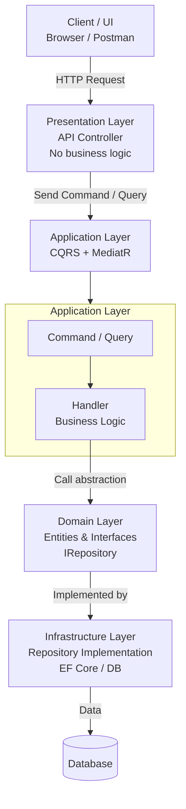

# 🔄 How CQRS Works

> **Tracing the path of data: From User to Database and back.**

---

## 🚦 The Two Separate Paths

In a normal application, there is primarily one "road" for data. In **CQRS**, we build **two distinct roads**:

1.  **The Command Road** 🛣️ (One-way traffic: **Changes Data**)
2.  **The Query Road** 🛤️ (One-way traffic: **Returns Data**)

---

## 1️⃣ The Write Flow (Command)

**Goal:** The user wants to *change* something (e.g., "Change my password").

### 🪜 Steps:
1.  **User Action**: User fills a form and clicks "Save".
2.  **API Request**: The UI sends a `ChangePasswordCommand` (JSON) to the API.
3.  **Validation**: The system checks the rules (e.g., "Is the new password strong?").
4.  **The Handler**: A specific `ChangePasswordHandler` picks up the request.
5.  **Write to DB**: The handler updates the **Write Database** (The source of truth).
6.  **Success**: The system returns `200 OK` (Success). It **does not** return the user object back.

**Diagram:**
```
User 👤 
 │
 ╰─(1)─▶ [API Controller] 
           │
           ╰─(2)─▶ [Command Handler] 🧠 (Logic & Validation)
                     │
                     ╰─(3)─▶ [Write Database] 💾 (Save State)
```

---

## 2️⃣ The Read Flow (Query)

**Goal:** The user wants to *see* something (e.g., "Show my profile").

### 🪜 Steps:
1.  **User Action**: User opens the "Profile" page.
2.  **API Request**: The UI sends a `GetUserProfileQuery` to the API.
3.  **No Complex Logic**: The system **skips** business validation. It just needs to fetch data.
4.  **The Handler**: A `GetUserProfileHandler` picks up the request.
5.  **Read from DB**: The handler fetches data from the **Read Database** (Optimized for speed).
6.  **Return**: The data is returned specifically shaped for the UI (DTO).

**Diagram:**
```
User 👤 
 ▲
 │ (4) Return Data
 └─[API Controller] 
     │
     ╰─(2)─▶ [Query Handler] ⚡ (Fast Fetch)
               │
               ╰─(2)─▶ [Read Database] 📖 (Read State)
```

---

## ⚙️ The "Sync" Magic (Synchronization)

*Wait... if we have two databases (Write DB and Read DB), how does the Read DB know data changed?*

This is handled via **Synchronization** (usually Events).

1.  **Command Side** finishes writing to the main DB.
2.  It shouts out an event: 📢 *"Hey! User 123 changed their password!"*
3.  **Read Side** is listening. It hears the event.
4.  **Read Side** updates its own database to match.

> ⏳ **Eventual Consistency**: There might be a tiny delay (milliseconds) between the Write and the Read update. This is acceptable in most modern systems.

---

## 🏗️ Detailed Architectural Flow

Here is how a request travels through the layers of the application.



---

## 🧩 The Role of MediatR

You might see "MediatR" mentioned often with CQRS. **MediatR** is just a library that helps us implement this pattern easily in .NET.

### 👮‍♂️ What is it? (The Traffic Controller)

Imagine a busy intersection.
- Without a Traffic Controller: Cars (Requests) drive everywhere, confused about where to go.
- **With MediatR**: Every car stops and asks the Controller: *"I have a 'CreateOrder' request. Where do I go?"*
- MediatR points and says: *"Go to handler #5."*

### ⚙️ How it works in code

1.  **The API Controller is dumb**: It doesn't know *how* to save a user. It just creates a message (Command) and gives it to MediatR.
    ```csharp
    // Controller just says "Here, take this!"
    await _mediator.Send(new CreateUserCommand(name, email));
    ```

2.  **MediatR finds the Expert**: MediatR looks through your code to find the one class that knows how to handle `CreateUserCommand`.

3.  **The Handler does the work**: The handler receives the message and executes the logic.

### 🏆 Why use it?
- **Decoupling**: The Controller doesn't need to depend on the Service. It only depends on MediatR.
- **Single Responsibility**: Each handler does exactly one thing.
- **Pipelines (Behaviors)**: Since all requests go through MediatR, you can easily add "Global Rules" like Logging, Validation, or Caching for *every* request automatically.

---

## 📝 Comparison: Standard Flow vs. CQRS Flow

| Step | Standard Architecture | CQRS Architecture |
|------|-----------------------|-------------------|
| **Entry Point** | Controller calls a Service | Controller sends a Command or Query |
| **Logic** | Logic, Validation, and Reads are mixed | **Strict separation**. Handler does only 1 thing. |
| **Database** | 1 Database for everything | Can use separate DBs for Read and Write |
| **Result** | Often returns the full Entity | **Command**: Returns specific status / **Query**: Returns specific DTO |

---

<div align="center">

**💡 Key Takeaway:**
*Commands push data **IN**. Queries pull data **OUT**.*
**They never cross paths! ❌**

</div>
