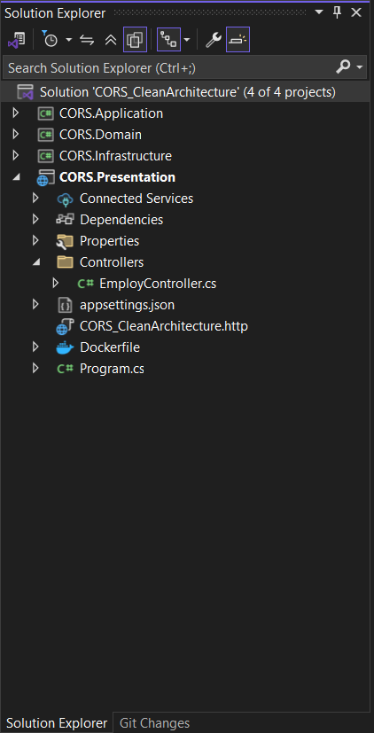

# 🛠️ Implement CQRS: Part 2 - Project Structure

> **Designing the 4 Layers of Clean Architecture with CQRS**

---

## 🏗️ The 4 Layers of CQRS

We split our application into four distinct circles (layers).

### 1️⃣ Domain Layer
*   **Business rules & entities**
*   **Interfaces (Repository)**
*   ❌ No framework, no database dependencies.

### 2️⃣ Application Layer
*   **CQRS logic**
*   **Commands, Queries, Handlers**
*   **DTOs, MediatR, AutoMapper**
*   ✅ Uses Domain interfaces.

### 3️⃣ Infrastructure Layer
*   **Database & EF Core**
*   **Repository implementations**
*   **External services**

### 4️⃣ Presentation Layer
*   **API / UI**
*   **Controllers & endpoints**
*   ✅ Sends Commands/Queries via **MediatR**.

---

## 🚀 Step-by-Step Guide to Create the Solution

Follow these steps in **Visual Studio Community** to set up the project structure.

### 🔹 Step 1: Open Visual Studio Community
1.  Launch Visual Studio Community.
2.  Click **Create a new project**.

### 🔹 Step 2: Create the Presentation Layer (API)
1.  Select **ASP.NET Core Web API**.
2.  Click **Next**.
3.  Enter Project Name: `Employ.Presentation`
4.  Click **Next**.
5.  Choose:
    *   Framework: **.NET 8** (or .NET 7)
    *   Authentication: **None**
    *   Enable OpenAPI (Swagger): **✅ Yes**
6.  Click **Create**.

> **✅ Purpose of Presentation Layer**
> *   Handles HTTP requests & responses
> *   Contains: Controllers, API endpoints
> *   Talks ONLY to **Application** layer
> *   ❌ No database logic
> *   ❌ No business rules

### 🔹 Step 3: Create Domain Layer
1.  Right-click on **Solution 'Employ.Presentation'**.
2.  Click **Add** → **New Project**.
3.  Select **Class Library**.
4.  Click **Next**.
5.  Project Name: `Employ.Domain`
6.  Click **Create**.

> **✅ Purpose of Domain Layer**
> *   Contains **core business rules**
> *   Contains: Entities (Employ, etc.), Domain logic
> *   **Independent** of all other layers
> *   ❌ No Entity Framework
> *   ❌ No Web API
> *   ❌ No external dependencies

### 🔹 Step 4: Create Application Layer
1.  Right-click on **Solution**.
2.  Click **Add** → **New Project**.
3.  Select **Class Library**.
4.  Click **Next**.
5.  Project Name: `Employ.Application`
6.  Click **Create**.

> **✅ Purpose of Application Layer**
> *   Contains **CQRS logic**
> *   Contains: Commands, Queries, DTOs, Interfaces (Repository, Services), MediatR handlers
> *   Depends on **Domain** only

### 🔹 Step 5: Create Infrastructure Layer
1.  Right-click on **Solution**.
2.  Click **Add** → **New Project**.
3.  Select **Class Library**.
4.  Click **Next**.
5.  Project Name: `Employ.Infrastructure`
6.  Click **Create**.

> **✅ Purpose of Infrastructure Layer**
> *   Contains **technical implementations**
> *   Contains: Entity Framework DbContext, Repository implementations, Database access
> *   Implements interfaces from **Application** layer.

---

## 📸 Final Project Structure

It should look like this after you create all the projects:

---

**🔜 Next Step:** [**Part 3 - Domain Layer Implementation**](./Implement_CQRS_Part_3.md)

